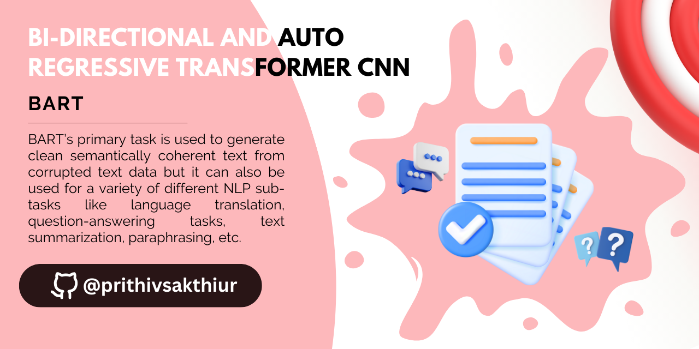
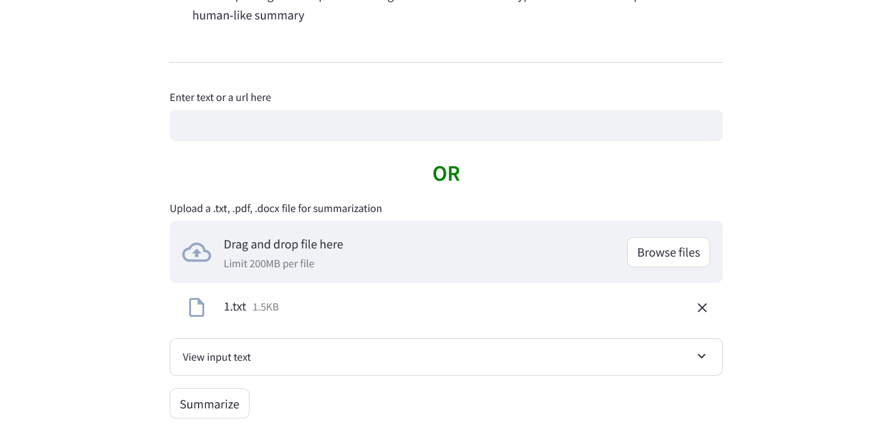
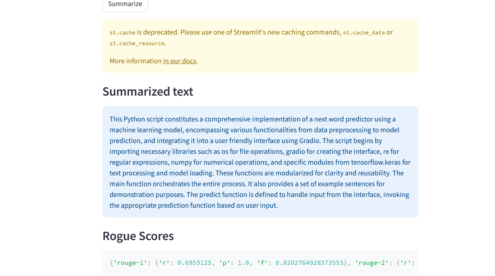

🚀Check out the configuration reference at https://huggingface.co/docs/hub/spaces-config-reference

🚀Huggingface Spaces : https://huggingface.co/spaces/prithivMLmods/Bart-Cnn

🚀Docs for Space : git clone https://huggingface.co/spaces/prithivMLmods/Bart-Cnn

## 👉 Entering the Content as Text / Docx / Pdf ...

## 🫙Processing the Content

.

.

.

